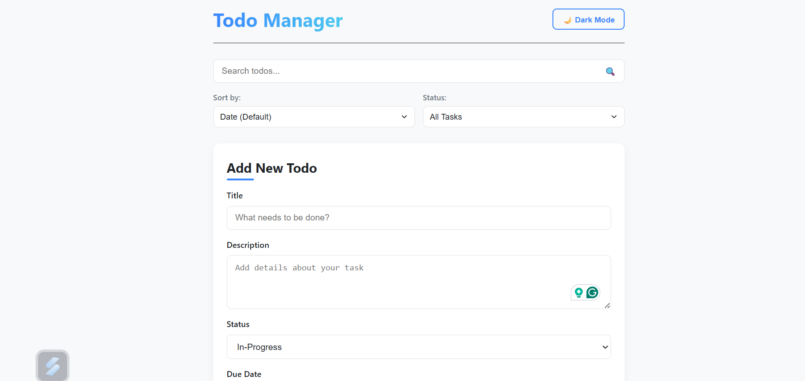
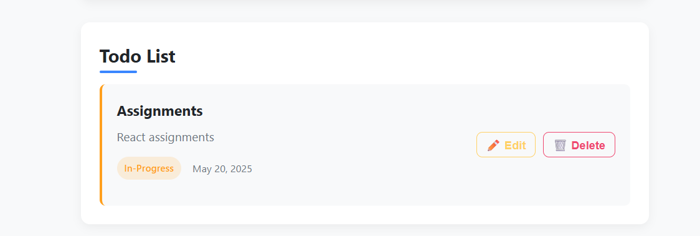
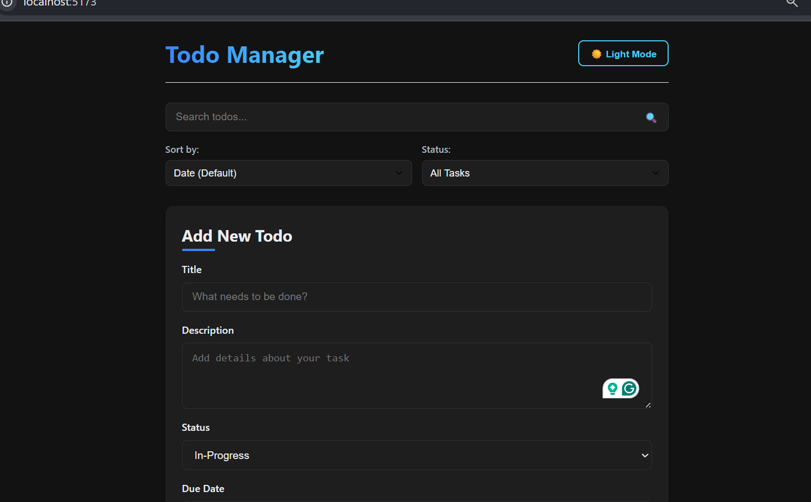

# 📝 Todo Manager App (React + Firebase)

The **Todo Manager App** is a powerful and user-friendly application built with **React** and **Firebase Realtime Database**. It allows users to add, edit, delete, search, filter, and sort tasks, with support for both light and dark themes, as well as a built-in calendar for setting due dates.

---

## 🚀 Features

- ✅ **Add new todos** with:
  - Title
  - Description
  - Status (In-Progress / Completed)
  - Due Date via calendar input
- ✏️ **Edit and update** existing todos
- ❌ **Delete tasks**
- 🔍 **Search todos** by title or description
- 🎯 **Filter todos** by:
  - Status (In-Progress / Completed)
  - Due Date (optional)
- 📊 **Sort todos** by:
  - Most Recent
  - Oldest
- 🌗 **Toggle between Light and Dark themes**
- 🔄 **Real-time data synchronization** with Firebase

---

## 🛠️ Tech Stack

- **Frontend**: React (using Context API and Hooks)
- **Database**: Firebase Realtime Database
- **HTTP Client**: Axios

---

## 📦 Installation

1. **Clone the repository**
   ```bash https:
   https://github.com/ayeshashaw/TodoList-With-FireBase.git
   cd todo-manager
   ```

2. **Install dependencies**
   ```bash
   npm install
   ```

3. **Start the development server**
   ```bash
   npm start
   ```

### 🔧 Firebase Setup

- Go to the Firebase Console.
- Create a new project.
- Enable the Realtime Database and set read/write permissions to public (for testing only):
   ```json
   {
     "rules": {
       ".read": true,
       ".write": true
     }
   }
   ```

- Replace the base URL in your API calls with: `https://your-project-id.firebaseio.com/todo.json`

---

## 🗂️ Project Structure

```
src/
│
├── components/
│   ├── TodoForm.js       # Form to add/edit todos
│   ├── TodoList.js       # Renders todo items
│   └── TodoItem.js       # Individual todo item
│
├── context/
│   └── ThemeProvider.js   # Global state and logic
│
├── App.js
└── index.js
```

---

## 🖼️ Screenshots

### 🌞 Light Mode



### 🌙 Dark Mode


---

## 📌 Future Enhancements

- Drag & drop reordering
- Category/label support
- Notifications or due date reminders
- Firebase Authentication

---

## 🙌 Contributing

Contributions, issues, and feature requests are welcome! Feel free to open an issue or submit a pull request.


## 📬 Contact
Feel free to connect with me on LinkedIn. [https://www.linkedin.com/in/ayesha-shaw/]
